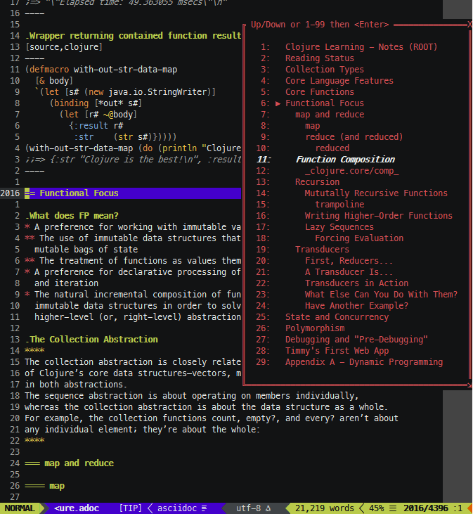

= musecnav
:toc: top
:toclevels: 3
:experimental:
:icons: font
// Stupid GitHub doing things their own stupid way. This is to match locally. (The
// default is, of course, underscore for both.)
:idprefix:
:idseparator: -
//:sectlinks:
ifdef::env-github[]
:tip-caption: :bulb:
:note-caption: :information_source:
:important-caption: :heavy_exclamation_mark:
:caution-caption: :fire:
:warning-caption: :warning:
endif::[]
//:hide-uri-scheme:
// :source-language: python
ifdef::env-github[]
:toc-placement!:
toc::[]
endif::[]

_Musecnav_ (**M**ark**U**p **SEC**tion **NAV**igation) is a Vim plugin that allows
allows quick navigation of sections in <<section-headers, well-formed>> Asciidoc and
Markdown documents.

== Overview

TIP: If you just want to jump in and go a quick read of <<hot-keys, Hot Keys>> should be
all that you need after installation.

I regularly edit files containing text formatted with Asciidoc markup. In large files
especially, moving from section to section is quite a pain so I decided to try my
hand at Vim plugin development and create a section navigation menu. I created it for
my own benefit originally but it's been so useful to me that it seemed like a good
idea to share it. And though I use Markdown far less frequently, it is obviously very
popular so I decided to add support for that, too.

Basically, the plugin works like this: open the navigation menu, navigate through the
section hierarchy until you get to the section you want. When the menu is closed the
cursor will be positioned at that section's header. 

The menu is updated, as necessary, each time it's opened so it accurately reflects
the document's section hierarchy and the current cursor position. There are several
layout schemes available (e.g. you can configure the plugin to always show the
hierarchy fully expanded or to only expand the subtree within which the cursor lies)
with additional schemes planned. There are a few other ways to customize the menu,
too, as described in <<settings>>.

== Installation

Standard stuff here. If you use a plugin manager that plays nice with GitHub you
probably know what to do. Using vim-plug as an example...

.vim-plug configuration
----
Plug 'b-layer/musecnav'
----

If you use Vim packages use git from the command line as follows.

.Vim package cloning (Unix/Linux)
----
git clone https://github.com/b-layer/musecnav.git ~/.vim/pack/{packdir}/start/musecnav
----

Replace `{packdir}` with whatever directory name you prefer.

(On Windows you'll likely be using `%USERPROFILE%/vimfiles` in place of `~/.vim`.)

== Hot Keys

=== Default Key Map

By default no keys are mapped. To enable the hotkey assignments described below add
the following to your vimrc file:

    let g:musecnav_use_default_keymap = 1

Otherwise see <<key-mappings, Key Mappings>> for help with defining your
own hotkeys.

WARNING: Since we don't want to override any of your existing key mappings you need
to explicitly configure this plugin's hot keys. If the default key assignments for
menu open and reset functions (namely kbd:[F7], kbd:[Shift+F7] and kbd:[Ctrl+F7])
don't conflict with your setup then all you need to do is to add the above line and
you're ready to start using _musecnav_.

=== Opening the Menu

kbd:[F7] :: Open the navigation menu.

=== Menu Navigation

If your version of Vim supports popups (i.e. version 8.1.1517 or later) the menu will
appear in a popup window. Otherwise it will appear as a "drawer" that slides up from
the bottom of the window. Note that navigation in the slide-up menu is somewhat
limited compared to the popup.

==== Popup

kbd:[J]/kbd:[K] or kbd:[Down]/kbd:[Up] :: Select next/previous row.

kbd:[Shift+J]/kbd:[Shift+K] :: Select last/first row. 

Numbers 1-99 :: Select row corresponding to the entered number(s) (see the sidebar).

kbd:[Enter] :: Move the cursor to the section header matching the selected row. The
               popup will remain open. If you hit kbd:[Enter] a second time within
               a couple seconds the popup will be closed.

kbd:[Esc], kbd:[Ctrl+C] or kbd:[X] :: Close the navigation menu popup.

.Numerical Selection in the Popup
****
A nice feature is being able to choose sections by entering their associated number.
(By default Vim menu popups don't support this which means you might have 50 sections
on screen but no way to navigate them except up or down, one line at a time!) That
being said, the way things are implemented _might_ seem a little peculiar so the
algorithm is detailed here...

There is a 1-digit "buffer" that is empty when the menu is opened.

* User enters a number when buffer is empty...
** ...if number matches a single row and is not the first digit of any other row
   numbers then select the matching row (the buffer remains empty).
** ...if number could match multiple rows select the first of the potential matches
   and store the number in the buffer.
* User enters a number when buffer is not empty...
** ...if combined number (previous is most significant digit, new is least
   significat) matches a single row, select that row and clear buffer.
** ...if combined number doesn't match a row, discard new number (previous number
   remains in buffer)

Example: 32 rows. User enters 3. Select line 3 and store num in buffer (in case they
intend to go to 30, 31 or 32). User then enters 5. No row 35 so discard 5 (leaving 3
in buffer and row 3 selected) User enters 1. Select row 31 and clear buffer. User
enters 9. Select row 9 but don't buffer num (since no other row nums start with 9).
User enters 2. Select row 2 and buffer num. Etc. When user finally accepts selection
with Enter buffer is always cleared.

If you get confused hit Enter and retype desired number. (Though, really, it's not
THAT confusing. ;) 

CAUTION: This currently only works for 2-digit numbers so if you have 100 or more
sections visible in the menu at one time the behavior is undefined. If you are
impacted by this please report it.

****

==== Slide-Up Drawer

Numbers 1-99 :: Rows are chosen by entering their associated number followed by Enter.
kbd:[Esc] / kbd:[Ctrl+C] or kbd:[Enter] by itself :: Close the menu.

=== Reset

_musecnav_ monitors the current buffer and if it detects a change that could impact
the _location_ of any sections in the saved hierarchy it will rescan the file and
show the updated hierarchy the next time the menu is opened. However, a change that
doesn't effect section locations, such as modifying a section title, will not result
in a rescan. In cases like this you can force a rescan with one of these reset
functions:

kbd:[Shift+F7] :: "Soft" reset. Rescan section headers and open the navigation
  menu. Cursor position will be preserved.

kbd:[Ctrl+F7] :: "Hard" reset. Rescan doc and section headers, reset the cursor to
                 the first line of the document and open the navigation menu.

== Settings

Unless otherwise noted, settings based on Vim variables can be configured either
as buffer-local or global. The differences are described below.

.Buffer-local variables...
* Have prefix `b:`.
* Are usually set on the command line of an open buffer.
* Affect _musecnav_ only in the buffer in which they are set.
* Take effect the next time the navigation menu is opened.
* Example: `let b:musecnav_display_mode = 'all'`

.Global variables...
* Have prefix `g:`.
* Are usually added to your vimrc file.
* Affect only buffers that are opened after the setting is added to your vimrc.
* Example: `let g:musecnav_display_mode = 'all'`

=== Key Mappings

As mentioned in the <<hot-keys, Hot Keys>> section you can enable default key
mappings by adding the following to your vimrc file:

    let g:musecnav_use_default_keymap = 1

If you'd prefer to define your own mappings it works like most plugins out there:
find the applicable `<Plug>` mappings and map the desired key(s) to the ones of
interest. You can find the `<Plug>` mappings for _musecnav_ by running the following
command while editing an Asciidoc or Markdown document:

    filter /musecnav/ map

The most important one is that which launches the navigation menu/popup.
Specifically, `<Plug>MusecnavNavigate`. A valid mapping to that would look like this:

        nmap <F7> <Plug>MusecnavNavigate

The only other `<Plug>` mappings you might want to consider configuring are
`<Plug>MusecnavReset` and `<Plug>MusecnavReinit`. Their functionality is described
here: <<reset, Hot Keys - Reset>>.

==== Swapping Function Keys

If you'd like to continue using a function key for the menu launch and reset
functions but prefer one other than kbd:[F7] then all you need to do other than
enabling `g:musecnav_use_default_keymap` is to specify which function key in
`g:musecnav_alt_fun_key`. For example, if you'd like to use kbd:[F3] to open the
navigation window add this to your vimrc file:

    let g:musecnav_alt_fun_key = 'F3'

This will also change the mappings for soft and hard resets, too, i.e. to
kbd:[Shift+F3] and kbd:[Ctrl+F3], respectively.

=== Section Display Modes

The way section headers are displayed in the navigation menu is configurable.
Specifically, there are rules for when headers are visible or not.

One of the rules is always in effect: _The currently selected section along with
all of its sibling, ancestor and child/descendant sections will always be visible._

For additional control set `musecnav_display_mode` as follows:

* `all`: the entire section hierarchy is visible at all times
* `top`: all of the top-level (level one) sections are visible at all times [default]
* `none`: no additional rules

`all` is pretty self explanatory but the other two require a bit more explanation
since what you see depends on the level of the currently selected header.

CAUTION: Only Asciidoc documents have a notion of "document root". For Markdown you
can just ignore it in the following explanations.

The displayed sections when at the top two levels are fixed as follows:

When the currently selected section is...

_...the document root (Asciidoc only):_

   Document root (level 0)
     All level 1 section headers

_...a top-level section (level 1):_

   Document root (level 0)
     All level 1 section headers
       Headers for selected section's subtree

_...deeper than level 1:_

This depends on the value of `musecnav_display_mode`.

If that setting is...

_...'top' (the default):_

   Document root (level 0)
     All level 1 sections preceding selection's level 1 ancestor
     Selection's ancestors, from level one to its parent's parent (levels 1 to N-2)
       Selection's parent section (at level N-1)
         All of the selection parent's child sections (level N)
           Selected section's subtree (level N+1 and down)
     All level 1 sections following selection's level 1 ancestor

_...'none':_

   Document root (level 0)
     Selection's ancestors, from level one to its parent's parent (levels 1 to N-2)
       Selection's parent section (at level N-1)
         All of the selection parent's child sections (level N)
           Selected section's subtree (level N+1 and down)

("Selection parent's child sections" is another way of saying "the selection and all
of its siblings".)

NOTE: I expect to soon have another display mode that will show the entire hierarchy
of the selected section's level one ancestor at all times. If you can think of any
other useful modes let me know.

==== Other Ways to Change the Mode

You can avoid setting `b:musecnav_display_mode` manually by using the user commands
`MusecnavNextLayout` and `MusecnavPrevLayout`. These cycle forward and back,
respectively, through the available settings.

The same underlying functionality is available for key mapping as shown in these
examples:

    nmap <leader>N <Plug>MusecnavNextLayout
    nmap <leader>P <Plug>MusecnavPrevLayout

=== Popup Placement

If you are using the popup menu it will by default appear on the right side of the
window, centered vertically. If you want it to appear further left you can specify
the column at which the popup's left side should be located with `musecnav_pop_col`.

For example, to have the popup open with its left side at column 50 in the current
buffer:

    let b:musecnav_pop_col = 50

=== Popup Menu Colors

If you are using the popup menu, note that Vim popups are colored based on highlight
groups `Popup` and `PopupSelected` or, if those are not set, `PMenu` and `PMenuSel`.
Because popups are relatively new you'll find that `Popup`/`PopupSelected` are rarely
set in color schemes. That means the `PMenu` groups are used and those aren't
explicitly set too often either which means you end up with the default for `PMenu`
which is a garish pink/magenta. So I decided to define the two `Popup*` groups by
default. Instead of a fixed set of colors, though, I link them to other highlight
groups. This way they will match (usually) whatever color scheme you are currently
using.

If you still want to override them you are free to. Example:

    hi Popup guifg=#3030ff guibg=black
    hi PopupSelected guifg=black guibg=#a0a0ff

=== Other Settings

==== Menu Type

Choose whether to use the popup or slide-up navigation menu with
`musecnav_use_popup`.

For example, to use the slide-up in all future runs of _musecnav_ add to your vimrc:

    let g:musecnav_use_popup = 0

Of course, if your version of Vim doesn't support popups then setting this to 1 will
have no effect.

==== Current Section Indicator

Change the in-menu 'current section' indicator with `musecnav_place_mark`. By
default, this is set to the character `▶`.

For example, to change the marker to a double angle bracket in the current buffer run
this from the command line:

    let b:musecnav_place_mark = '≫'

== Section Headers

*This plugin will not work correctly if you do not use use valid section header
syntax and semantics.* Precisely what that means isn't necessarily obvious,
particularly in the case of Markdown, so in this section we'll spell it all out.

.Markdown requirements
* Vim's syntax highlighting feature _must_ be enabled.
* Use a header format recognized by syntax highlighting.
* Use legal section flow, i.e. _don't skip section levels when ascending_.

.Asciidoc requirements
* Use legal section flow, i.e. _don't skip section levels when ascending_.

NOTE: For most of its doctypes Asciidoc also allows "document" headers. These are
found at the very beginning of a document and are denoted by a single `=` (or `#`)
and are largely ignored by _musecnav_ at this time.

[big yellow-background]#WIP. Additional details including a referesher on valid syntax coming soon!#
